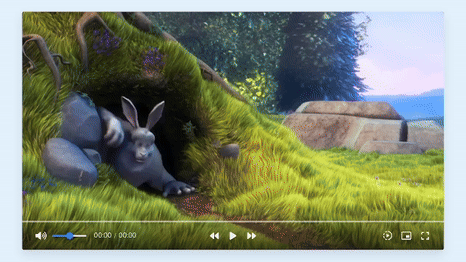

# Custom Video Player

## Demo

## Try it out

## Todo

- [x] Add basic controls (play, pause, skip forwards and backwards)
- [x] Add playback speed controls
- [x] Add fullscreen and pic-in-pic modes
- [x] Add volume controls
- [ ] Enable seeking
- [ ] Update video length and progress numbers (the 0:00/0:00 part)

## Acknowledgement

I made this by following this tutorial on [YouTube](https://www.youtube.com/watch?v=-r9TTW0D3t4)
